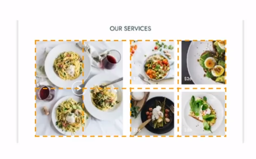

# restaurante

Esta es un proyecto de maquetado para una pagina 
de un restaurante ficticio 

Vamos a realizar la primera sección 

Para la segunda sección, vamos a tomar el elemento 
mas pequeño de las imagenes como referencia 
ya que este debe ocupar una celda de la grilla
por lo tanto las imagenes las 4 imagenes a la 
izquierda se distribuiran una en cada celda 
y la imagen de la derecha ocupara el espacio de 4 imagenes
por lo tanto nuestra grilla ocupara 4 columnas y 2 filas

Tambien se haran algunos cambios a nivel de estilos 
en la primera sección

